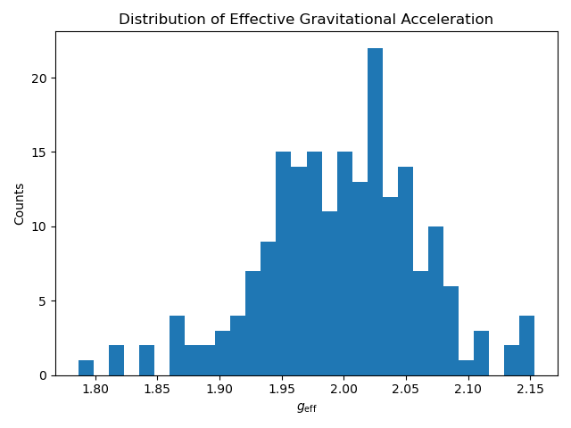
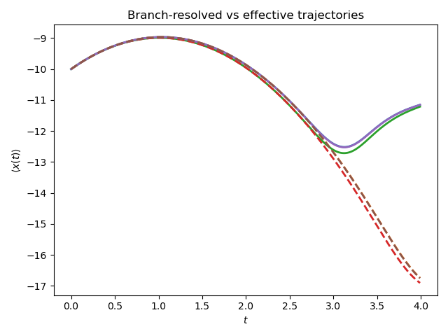
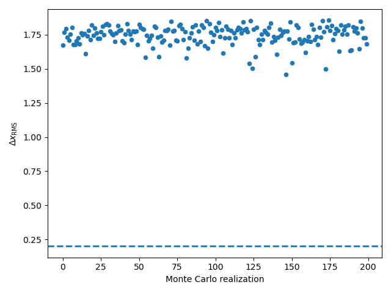
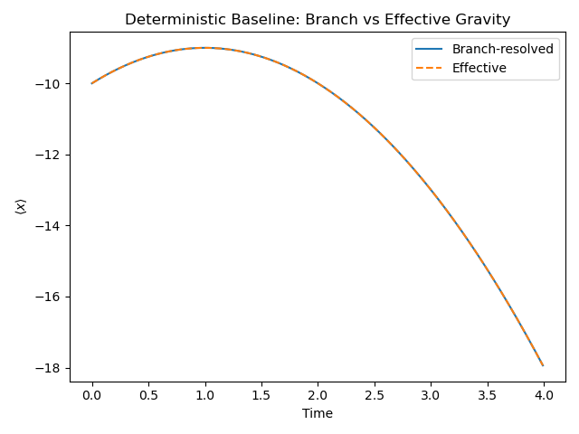
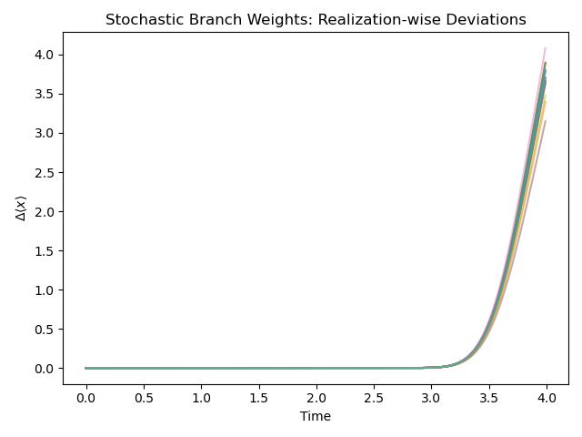

# Stability limits of effective gravitational models under quantum superposition
### Quantum Gravity Superposition Program -- Project 2
Numerical framework for investigating the **dynamical stability of effective gravitational descriptions** when gravitational fields are associated with **quantum superpositions of classical configurations**.

This repository contains the simulation code used in the study:

**V. I. Kiosses**

Stability limits of effective gravitational descriptions under quantum superposition (2026)

## Overview
In many semiclassical approaches to gravity, a **single effective gravitational field** is used to represent a system whose underlying gravitational configuration may involve multiple quantum branches.
In situations where gravity itself is associated with a quantum superposition of classical configurations, such effective descriptions may become unreliable.

This project investigates this question through direct numerical comparison between:
- **branch-resolved quantum dynamics**
- **effective gravitational evolution**
The central goal is to determine **when an effective gravitational description remains dynamically stable** under uncertainty in the underlying quantum superposition.

## Research Program Context
This repository is part of a **three-project research program** studying gravitational fields in quantum superposition.

- [Project 1: quantum-gravity-superposition-dynamics](https://github.com/kiossesv/quantum-gravity-superposition-dynamics)
Numerically stable solver for branch-resolved quantum dynamics in superposed gravitational fields.

- [Project 2: quantum-gravity-superposition-stability](https://github.com/kiossesv/quantum-gravity-superposition-stability) (this repository)
Statistical stability analysis of effective gravitational models.

- [Project 3: quantum-gravity-superposition-sciml](https://github.com/kiossesv/quantum-gravity-superposition-sciml) (planned)
Physics-informed machine learning for predicting stability regimes of effective gravity.

## Physical Model
We consider a non-relativistic quantum particle evolving under branch-dependent gravitational fields $V_i(x)=mg_i x$.

Each branch evolves independently under $\hat{H}_i = \frac{\hat{p}^2}{2m} + V_i(x)$.

The full quantum state is $\Psi(x,t) = \sum_i c_i \psi_i(x,t)$.

This branch-resolved formulation retains the full information about the superposed gravitational configuration.

### Effective Gravitational Approximation
A commonly used approximation replaces the superposed fields with a single effective acceleration $g_{\text{eff}}=\sum_i |c_i|^2 g_i$.

The particle then evolves under $V_{\text{eff}}=mg_{\text{eff}} x$.

The effective description therefore replaces a coherent multi-branch gravitational configuration with a single averaged field. The key question addressed in this project is: **Is this approximation dynamically stable?**

## Numerical Method
The simulations use a **spectral split-operator solver** for the time-dependent Schrödinger equation.
Features:
- FFT-based propagation
- second-order split-operator method
- periodic spatial domain
- branch-resolved evolution
- Monte-Carlo ensemble simulations
The solver is inherited from **Project 1**, where its unitarity and numerical stability were validated.

### Stability Test Framework
To probe robustness, controlled stochastic uncertainty is introduced in the branch weights $|c_i|^2 \rightarrow |c_i|^2 + \delta_i$.

Each Monte-Carlo realization defines a perturbed effective acceleration $g_{\text{eff}}=\sum_i (c_i|^2 + \delta_i) g_i$.

The resulting effective evolution is compared with the branch-resolved reference dynamics.

### Stability Diagnostics
The primary observable used to compare the two descriptions is $\langle \hat{x}(t) \rangle$.

Trajectory disagreement is quantified using the RMS deviation $\Delta x_{RMS} = \left( \frac{1}{T}\int_0^T (\langle x(t) \rangle_{eff}} - \langle x(t) \rangle_{ref})^2 dt \right)^{1/2}$.

An effective model is considered **unstable** when $\Delta x_{RMS} > \Delta x_{\text{crit}}$.

The ensemble failure probability is $P_{\text{fail}} = \frac{1}{N} \sum_{k=1}^N \Theta \left( \Delta x_{RMS}^{(k)} - \Delta x_{\text{crit}}^{(k)}\right)$.

## Scientific Results Preview
The numerical framework implemented in this repository was used to investigate the **stability of effective gravitational descriptions** when the underlying gravitational configuration is associated with a **quantum superposition of classical fields**.
The simulations compare:
- branch-resolved quantum dynamics (reference model)
- effective gravitational evolution using an averaged field
under controlled stochastic perturbations of the branch weights.

### Distribution of the Effective Gravitational Field
Monte Carlo sampling of stochastic branch weights produces a distribution of the effective gravitational acceleration $g_{\text{eff}}$.
Despite the introduced uncertainty, the distribution remains **narrow and well defined**, indicating that the effective gravitational parameter itself is statistically stable.



### Trajectory Deviations
Even when fluctuations in the effective gravitational acceleration are small, the resulting trajectories deviate progressively from the branch-resolved dynamics.
Because gravitational acceleration enters directly into the equations of motion, small mismatches accumulate in time.

Solid lines represent the **branch-resolved reference dynamics**, while dashed lines correspond to **effective gravitational evolution**.
The deviations grow systematically during the evolution.

### Ensemble Stability Analysis
The stability of the effective description is evaluated using the RMS deviation $\Delta x_{RMS}$.
Across the Monte Carlo ensemble, the RMS deviation exceeds the stability threshold in nearly all realizations.

This leads to a **failure probability approaching unity** in the investigated parameter regimes.

### Physical Interpretation
The instability arises from a structural difference between the two descriptions.
The branch-resolved dynamics preserves correlations between the probe motion and the underlying gravitational configuration, while the effective model replaces the superposed gravitational fields with a single averaged field.
Small fluctuations in the effective acceleration therefore accumulate deterministically during time evolution, producing trajectory deviations that grow approximately as $\Delta x \propto t^2$.

### Key Result
Although the effective gravitational acceleration remains statistically well defined, the corresponding dynamical trajectories become unstable under stochastic perturbations of the quantum superposition structure.
This reveals a **structural limitation of effective gravitational descriptions** in regimes involving **quantum superpositions of gravitational fields**.


## Repository Structure
```
quantum-gravity-superposition-stability/
│
├── src/
│        core solver (from Project 1)
│        ├── solvers.py
│        ├── observables.py
│        ├── potentials.py
│        ├── initial_states.py
│
│        stochastic stability framework
│        ├── samplers.py
│        ├── effective_gravity.py
│        ├── ensemble_runner.py
│
│        analysis utilities
│        ├── metrics.py
│        ├── analysis.py
│
│        numerical experiments
│        ├── deterministic_baseline.py
│        ├── stochastic_weights.py
│        └── monte_carlo_stability.py
│
├── figures/
│
│        documentation
└── README.md
```

## Reproducibility Instructions
### Running the Simulations

**Deterministic benchmark**

 `python deterministic_baseline.py`
 
Computes the deterministic baseline by evolving the system under branch-resolved gravitational fields and comparing it with the corresponding effective gravitational model.



Comparison of the expectation value $\langle x(t) \rangle$ obtained from branch-resolved dynamics and the effective gravitational field, showing agreement in the noiseless reference case.


**Stochastic branch perturbations**

` python stochastic_weights.py`

Simulates Monte Carlo realizations of stochastic branch weights and compares branch-resolved dynamics with the corresponding effective gravitational model.



Each curve shows the deviation $\Delta \langle x(t) \rangle$ between branch-resolved and effective trajectories for one stochastic realization, illustrating the time-accumulation of small acceleration mismatches.

**Full Monte-Carlo stability analysis**

`python monte_carlo_stability.py`

Computes RMS deviations and failure probability across ensembles.


## Current Limitations
The present implementation focuses on a minimal controlled model:
- one spatial dimension
- uniform gravitational potentials
- coherent branch dynamics
- no decoherence
- no phase noise
These restrictions allow a clear investigation of stability properties of effective gravity.

## Future Directions
Possible extensions include:
- non-uniform gravitational fields
- multi-branch superpositions
- decoherence effects
- higher-dimensional dynamics
- machine-learning stability prediction (Project 3)

## Citation
If you use this code in research, please cite:

Kiosses, V. I.

Stability limits of effective gravitational descriptions under quantum superposition (2026)
